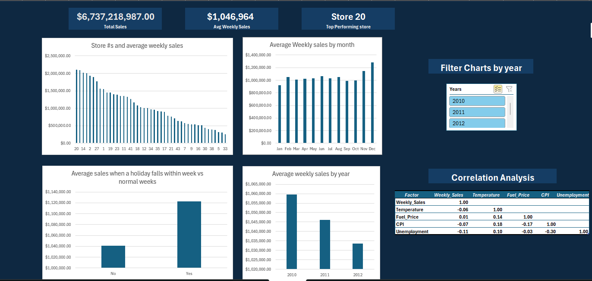

# Walmart Sales Data Analysis — Excel Dashboard

## Overview
An exploratory data analysis of Walmart's weekly sales data across 45 stores from 2010–2012, 
built entirely in Microsoft Excel. This project demonstrates data cleaning, pivot table analysis, 
correlation analysis, and interactive dashboard design.

## Dataset
- **Source:** [Kaggle — Walmart Dataset](https://www.kaggle.com/datasets/yasserh/walmart-dataset)
- **Size:** 6,435 rows across 45 stores
- **Fields:** Store, Date, Weekly Sales, Holiday Flag, Temperature, Fuel Price, CPI, Unemployment

## Data Cleaning
- Removed 1,042,140 duplicate rows leaving 6,435 unique records
- Normalized inconsistent date formats using Text to Columns (DMY format)
- Converted Holiday Flag from binary (0/1) to readable Yes/No values

## Analysis & Key Findings
- **Store 20** is the top performing store at $2.1M average weekly sales
- **Holiday weeks** drive approximately 8% higher average sales vs normal weeks, though this 
likely understates the true holiday effect given consumer pre-holiday shopping behavior
- **December and November** are the strongest sales months, while September is the weakest
- A correlation matrix across macro factors (unemployment, CPI, fuel price, temperature) revealed 
weak relationships with weekly sales, suggesting Walmart's revenue is relatively resilient to 
macroeconomic conditions — consistent with its positioning as an everyday essentials retailer
- **2012 sales appear lower** than 2010–2011 but this is due to incomplete data; the dataset 
ends mid-2012

## Excel Features Used
- PivotTables and PivotCharts
- Data Analysis ToolPak (Correlation Matrix)
- Slicers with Report Connections
- Conditional formatting
- Text to Columns for data cleaning
- Dashboard design with KPI callout boxes

## Dashboard Preview

